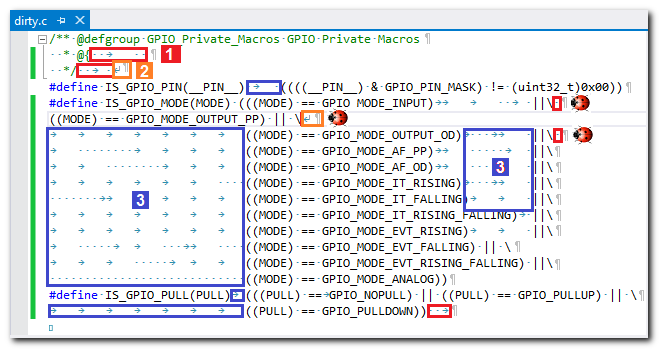
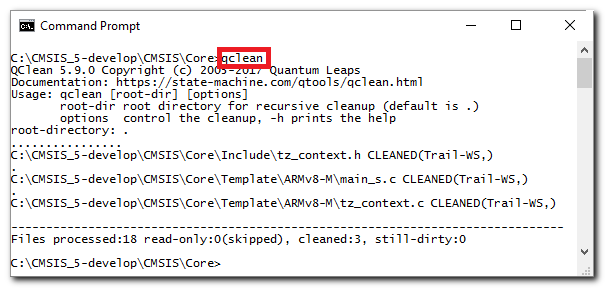

Many programmers pay little attention to the whitespace in their source code, such as spaces, tabs, newlines, etc. The common thinking is that compilers (C, C++, etc.) ignore whitespace anyway, so why bother? But, as a professional software developer, you should not ignore whitespace, because it can cause all sorts of problems, some of them illustrated in the figure below:

1 Trailing whitespace after the last printable character in line can cause bugs. For example, trailing whitespace after the C/C++ macro-continuation character '\' can confuse the C pre-processor and can result in a program error, as indicated by the bug icons.

2 Similarly, inconsistent use of End-Of-Line (EOL) convention? can cause bugs. For example, mixing the DOS EOL Convention (0x0D,0x0A) with the Unix EOL Convention (0x0A) can confuse the C pre-processor and can result in a program error, as indicated by the bug icons.

3 Inconsistent use of tabs and spaces can cause unnecessary churn in the version control system (VCS) in source files that otherwise should be identical. Also, inconsistent use of whitespace can lead to different renderings of the source code by different editors and printers.

> **Attention**
The problems caused by whitespace in the source code are particularly insidious, because you **don't see** the culprit. By using an *automated* whitespace cleanup utility, you can save yourself hours of frustration and significantly improve your code quality.

# QClean Source Code Cleanup Utility
QClean is a simple and blazingly fast command-line utility to automatically clean whitespace in your source code. QClean is deployed as a natively compiled executable and is located in the sub-directory `qtools/bin/`. QClean is available in portable source code and can be compiled on all desktop platforms (Windows, Linux, macOS...).

> **Attention**
QClean is very simple to use (no parameters are needed in most cases) and is blazingly fast (it can easily clean up hundreds of files per second). All this is designed so that you can use QClean frequently. In fact, the use of QClean after editing your code should become part of your **basic hygiene** — like washing hands after going to the bathroom.

# QClean Usage
Typically, you invoke QClean from a command-line prompt without any parameters. In that case, QClean will clean up white space in the current directory and recursively in all its sub-directories.

> **Note**
QClean is very simple to use (no parameters are needed in most cases) and is blazingly fast If you have added the qtools/bin/ directory to your PATH environment variable (see Installing QTools), you can run qclean directly from your terminal window.

As you can see in the screenshot above, QClean processes the files and prints out the names of the cleaned-up files. Also, you get information as to what has been cleaned, for example, "Trail-WS" means that trailing whitespace has been cleaned up. Other possibilities are: "CR" (cleaned up DOS/Windows (CR) end-of-lines), "LF" (cleaned up Unix (LF) end-of-lines), and "Tabs" (replaced Tabs with spaces).

## QClean Command-Line Parameters
QClean fixes the following whitespace problems:

- removing of all trailing whitespace (see figure above 1)
- applying consistent End-Of-Line convention (either Unix (LF) or DOS (CRLF), see figure above 2)
- replacing Tabs with spaces (untabify, see figure above 2)
- optionally, scan the source code for long lines exceeding the specified limit (-l option, default 80 characters per line).

> **Note**
QClean can optionally check the code for **long lines of code** that exceed a specified limit (80 characters by default) to reduce the need to either wrap the long lines (which destroys indentation), or to scroll the text horizontally. (All GUI usability guidelines universally agree that horizontal scrolling of text is always a bad idea.) In practice, the source code is very often copied and pasted and then modified, rather than created from scratch. For this style of editing, it's very advantageous to see simultaneously and side-by-side both the original and the modified copy. Also, differencing the code is a routinely performed action of any VCS (Version Control System) whenever you check in or merge the code. Limiting the line length allows us to use the horizontal screen real estate much more efficiently for side-by-side-oriented text windows instead of much less convenient and error-prone top-to-bottom differencing.

## QClean File Types
QClean applies the following rules for cleaning the whitespace depending on the file types:

| FILE TYPE | END-OF-LINE | TRAILING WS | TABS | LONG-LINES |
|-----------|-------------|-------------|------|------------|
|.c|Unix (LF)|remove|replace|check|
|.h|Unix (LF)|remove|replace|check|
|.cpp|Unix (LF)|remove|replace|check|
|.hpp|Unix (LF)|remove|replace|check|
|.s/.S|Unix (LF)|remove|replace|check|
|.asm|Unix (LF)|remove|replace|check|
|.txt|Unix (LF)|remove|replace|don't check|
|.xml|Unix (LF)|remove|replace|don't check|
|.dox|Unix (LF)|remove|replace|don't check|
|.md|Unix (LF)|remove|replace|don't check|
|.bat|Unix (LF)|remove|replace|don't check|
|.ld|Unix (LF)|remove|replace|check|
|.py|Unix (LF)|remove|replace|check|
|.pyw|Unix (LF)|remove|replace|check|
|.java|Unix (LF)|remove|replace|check|
|Makefile|Unix (LF)|remove|leave|check|
|mak_*|Unix (LF)|remove|leave|check|
|.mak|Unix (LF)|remove|leave|check|
|.make|Unix (LF)|remove|leave|check|
|.html|Unix (LF)|remove|replace|don't check|
|.htm|Unix (LF)|remove|replace|don't check|
|.css|Unix (LF)|remove|replace|don't check|
|.eww|Unix (LF)|remove|replace|don't check|
|.ewp|Unix (LF)|remove|replace|don't check|
|.ewd|Unix (LF)|remove|replace|don't check|
|.icf|Unix (LF)|remove|replace|don't check|
|.sln|Unix (LF)|remove|replace|don't check|
|.vcxproj|Unix (LF)|remove|replace|don't check|
|.filters|Unix (LF)|remove|replace|don't check|
|.vcxproj.filters|Unix (LF)|remove|replace|don't check|
|.project|Unix (LF)|remove|replace|don't check|
|.cproject|Unix (LF)|remove|replace|don't check|
|.pro|Unix (LF)|remove|replace|don't check|
|.m|Unix (LF)|remove|replace|check|
|.lnt|Unix (LF)|remove|replace|check|
|.cfg|Unix (LF)|remove|replace|don't check|
|.properties|Unix (LF)|remove|replace|don't check|

> **Note**
The cleanup rules specified in the table above can be easily customized by editing the array l_fileTypes in the `qclean/source/main.c` file. Also, you can change the **Tab size** by modifying the TAB_SIZE constant (currently set to 4) as well as the default **line-limit** by modifying the LINE_LIMIT constant (currently set to 80) at the top of the qclean/source/main.c file. Of course, after any such modification, you need to rebuild the QClean executable and copy it into the qtools/bin directory.

> **Attention**
For best code portability, QClean enforces the consistent use of the specified End-Of-Line convention (typically Unix (LF)), **regardless of the native EOL** of the platform. The DOS/Windows EOL convention (CR, LF) is typically not applied because it causes compilation problems on Unix-like systems (Specifically, the C preprocessor doesn't correctly parse the multi-line macros). On the other hand, most DOS/Windows compilers seem to tolerate the Unix EOL convention without problems.
